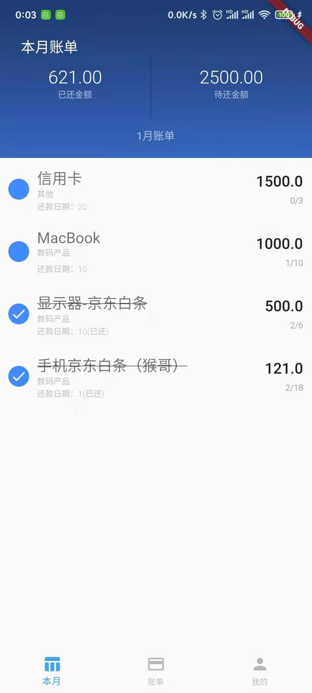
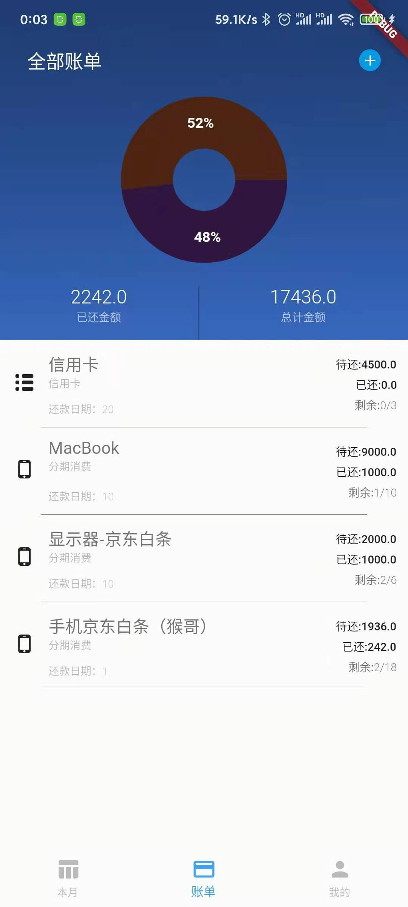
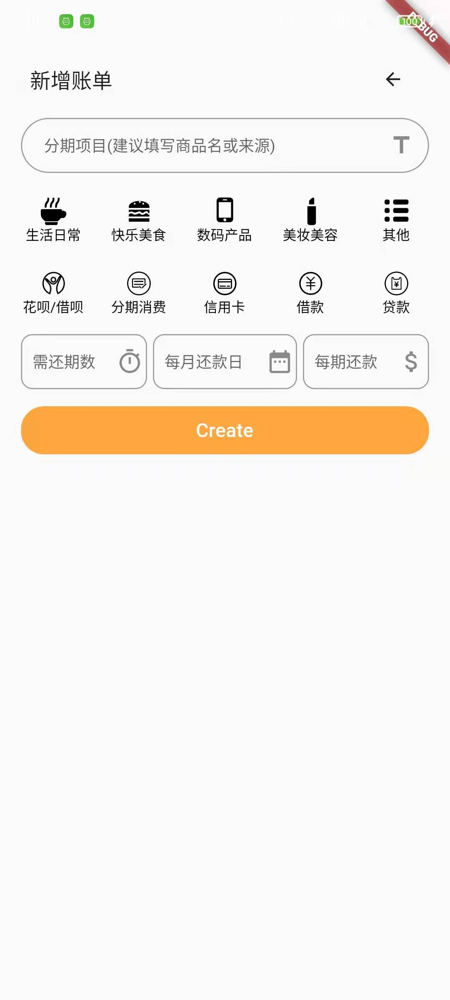
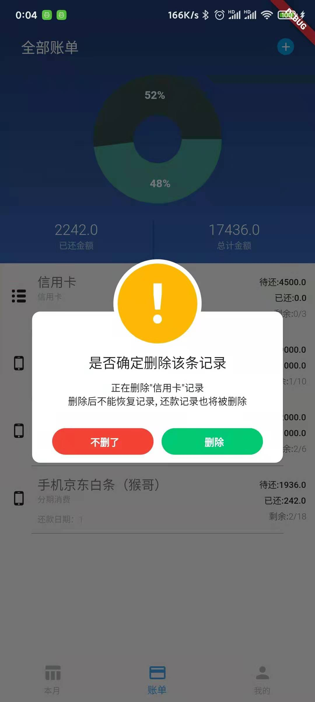

#理智消费 (Consume)

> 为了规划自己的分期账单和借款，和不忘记自己的债务而做的一款账单记录应用，同时提醒自己理智消费。

### 已经完成的功能

> 1. 账单的新增和删除
> 2. 根据当前时间顶部的背景图展示不同的渐变色
> 3. 根据当前月份显示出本月需要还款记录
> 4. 图标展示不同类别的账单占比
> 5. 可以选择头像和填写名字（虽然这个没什么实际作用 但就是想加上
> 6. 提供常用的几个类别选项和Icon
> 7. 勾选记录时会有金额滚动动画（都是钱啊!!
> 8. 一键清除数据

### 已经完成界面

<table>
  <tbody>
    <tr>
      <td align="center" width="200" valign="top">
        
      </td>
      <td align="center" width="200" valign="top">
        
      </td>
      <td align="center" width="200" valign="top">
        
      </td>
      <td align="center" width="200" valign="top">
        
      </td>
      <td align="center" width="200" valign="top">
        
      </td>
     </tr>
  </tbody>
</table>


### 未来完成功能

> 1. [] 联入登陆功能, 并且同步数据
> 2. [] 可选择月份展示数据 
> 3. [] 提供更多的账单新建方式
> 4. [] 争取发布
> 5. [] 整好看点 ( 目前都是直男审美来做的哈哈哈哈哈哈哈啊哈哈哈
> 6. 提供更多的Icon

## 运行方式

- 运行启动您的应用
```dart
  flutter packages get
  flutter run
```

## 开发和调试环境

模拟机为红米K30 Pro 已经尽力适配不同分辨率的处理了;

## 如果有其他问题,可联系交流
abigeater@163.com
